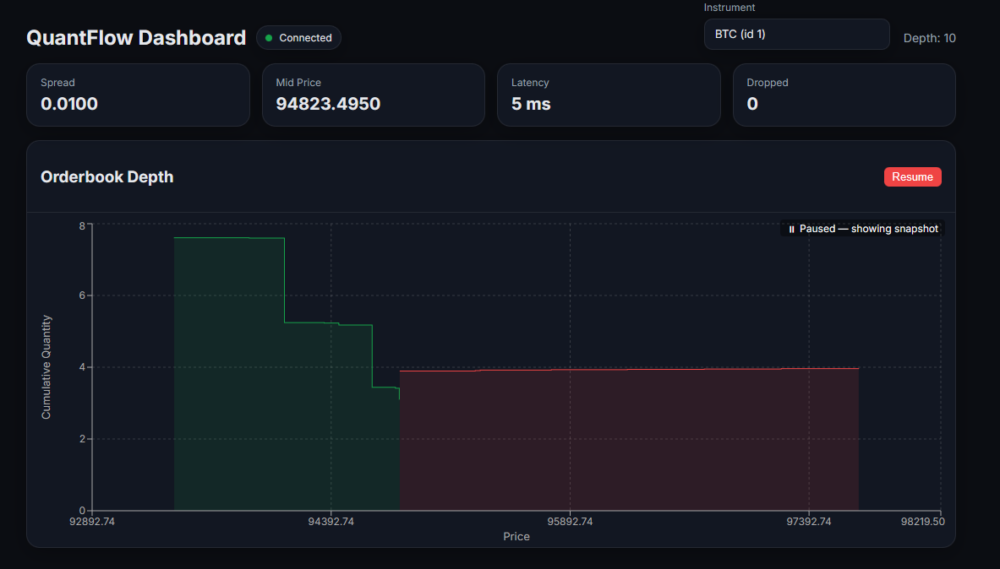

# QuantFlow

A real-time market data visualisation platform in Python that streams live orderbook updates.




## Motivation

I built this project because I wanted hands-on experience with **high-performance real-time systems** like those used in trading firms and exchanges.
I’ve always been fascinated by how market data flows from exchanges at high speed, how orderbooks update hundreds of times per second and how client applications consume and visualise those streams.

This project let me explore:

- low-latency gRPC streaming
- WebSocket fan-out and buffering

## Quick Start

### Option 1 - Run with Docker (Recommended)

Make sure you have **Docker** installed.

```bash
docker compose up --build
```
### Option 2
1. Create and activate a virtual environment

```bash
python3 -m venv venv
source venv/bin/activate        # macOS / Linux
```
2. Start backend and gateway

Backend (Terminal 1)
```bash
cd src/backend
pip install -r server/requirements.txt
python -m server.server
```

Gateway (Terminal 2)
```bash
pip install -r gateway/requirements.txt
uvicorn gateway.main:app --reload
```

3. Start frontend
```bash
cd ../frontend
npm install
npm run dev
```

## Usage
Instead of viewing the data through a WebView, you can also run the interactive
**CLI client** to connect directly to the gRPC backend.

To start the client, run:
```bash
cd src/backend
python -m server.client
```
#### Available Commands
```bash
l / list     - List all available instruments
s <index|id> - Start streaming an instrument (by list index or ID)
c / close    - Close the current stream
p / pause    - Pause printing of updates
r / resume   - Resume printing of updates
i            - Show the current active instrument
h / help     - Show this help message
q / quit     - Exit the client
```

## Contributing
### Clone the repo

```bash
git clone https://github.com/anthonyhuangg/QuantFlow.git
cd QuantFlow
```

### Run the test suite

```bash
pytest
```

### Submit a pull request

If you'd like to contribute, please fork the repository and open a pull request to the `main` branch.